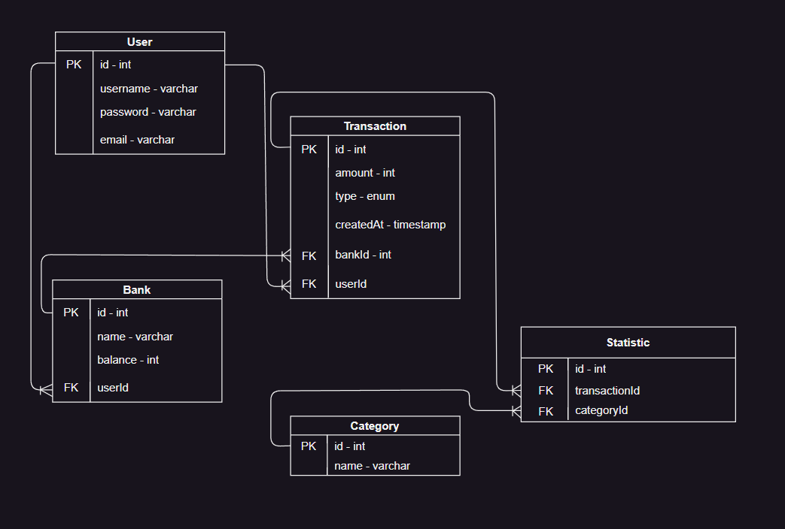

# Getting Started with the "Codica Back" server

## Step 1

In the project directory run:

### `npm install`

This command will install all the needed dependencies to the server.

## Step 2

This project uses postgresql database to store data.\
Now you need to tell the server the database data that points to your own database.

Database configuration is stored inside `src/config/configuration.ts`
You can override configuration parameters by passing them via ENV variables or by locally modifind default variables
Default config parameters:

```javascript
DB_HOST = localhost;
DB_USER = postgres;
DB_PASSWORD = admin;
DB_DATABASE = codica_back;
DB_PORT = 5432;
JWT_SECRET = secret;
JWT_EXPIRES_IN = 3600;
```

## Step 3

Now you need to migrate project data models to your database.\
First, make sure you have psql on your local machine.\

### Run in order to create `codica_back` database it it doesn't exist,

`psql -U postgres -tc "SELECT 1 FROM pg_database WHERE datname = 'codica_back'" | grep -q 1 || psql -U postgres -c "CREATE DATABASE codica_back"`

### In order to migarate, run this command from the project root directory:

### `psql -h db_hostname -d db_name -U db_username -f sql.sql`

### Example

`psql -h 127.0.0.1 -d codica_back -U postgres -f sql.sql`

Here write you hostname after `-h`, database name after `-d`, username after `-U`. After `-f` leave `sql.sql`.

## Step 4

Now your server is good to go.

Run this command in the project directory to start:

### `npm start`

You server runs on [http://localhost:3000](http://localhost:3000)

## Database schema


